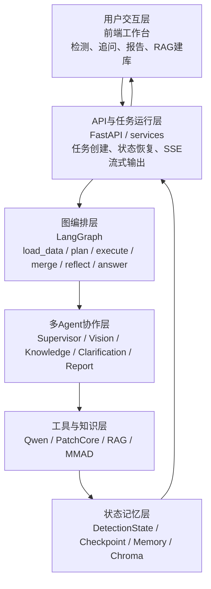

# 系统总体设计

## 1. 设计目标

本系统面向工业视觉异常检测与诊断场景，目标是构建一个能够完成图像异常识别、异常区域定位、相似案例检索、缺陷成因分析、多轮追问和诊断报告生成的智能检测系统。与传统单模型检测系统不同，本系统并不只依赖某一个视觉模型直接输出结论，而是采用多 Agent 协同和图状态编排的方式，将视觉检测、知识检索、任务规划、结果反思和报告生成拆分为多个相对独立的功能模块。

系统设计主要考虑以下目标。

第一，系统需要支持工业异常检测的完整任务链路。工业质检并不只要求判断图像是否异常，还需要说明异常出现的位置、类型、严重程度、可能成因、风险影响以及后续处理建议。因此系统需要同时具备视觉感知能力和知识分析能力。

第二，系统需要具备一定的可扩展性。不同工业场景对检测模型的要求不同。对于已知类别和标准数据集，可以使用 PatchCore 等传统工业异常检测算法生成热力图；对于开放类别或未训练类别，可以使用 Qwen 等通用视觉大模型进行初步视觉理解；对于需要专业解释的场景，可以结合 RAG 知识库检索相似案例。因此系统需要将模型能力封装为可替换的工具，而不是固定在某一个模型实现上。

第三，系统需要支持多轮交互。工业检测结果往往需要人工确认、继续追问或生成报告。因此系统需要保存任务状态、对话历史、Agent 执行过程和中间结果，使用户能够基于同一任务继续追问，而不是每次都重新开始检测。

第四，系统需要具备可观测性和可靠性。多 Agent 系统中，任务会经历规划、执行、合并、反思和回答等多个阶段。如果某一环节失败，系统需要能够记录失败位置、触发重试或要求用户澄清。同时，前端需要展示多 Agent 执行时间线，帮助用户理解系统当前运行状态。

基于上述目标，系统采用分层架构设计，整体包括用户交互层、API 与任务运行层、图编排层、多 Agent 协作层、工具与知识层、状态记忆层六个部分。

## 2. 总体架构

系统整体架构如图所示。用户通过前端工作台上传待检测图片并输入问题，前端将请求发送至 FastAPI 后端。后端将请求封装为统一的检测任务对象，并交由 LangGraph 状态图进行流程编排。图编排层首先调用 SupervisorAgent 生成执行计划，再由不同专家 Agent 执行视觉检测、知识检索、澄清提问或报告生成。各 Agent 的执行结果会被写入共享上下文，最后由 AnswerNode 综合视觉结果、知识上下文、历史对话和结构化分析结果生成中文诊断回答。

从数据流角度看，系统的输入主要包括用户上传的图像、文本问题、检测参数和任务标识；系统的中间数据包括视觉检测结果、RAG 检索结果、Agent 执行事件、MMAD 七任务分析结果和对话历史；系统的输出包括异常判断、异常位置、热力图、相似案例、缺陷分析、产品分析、最终回答和完整报告。

系统的核心思想是将“检测”拆分为“感知、检索、分析、反思、回答”五类动作。视觉模型负责感知图像中的可疑区域，RAG 知识库负责提供正常样本、异常样本和相似案例，知识分析模块负责推断成因和风险，反思节点负责判断结果是否可靠，最终回答节点负责将多源信息组织成面向用户的诊断结论。

## 3. 用户交互层设计

用户交互层由单页前端工作台实现，对应项目中的 `web/index.html`。该层直接面向用户，负责完成图片上传、参数配置、检测启动、追问输入、澄清提交、报告生成和结果展示。

前端工作台主要包括以下功能区域。

任务配置区域用于输入设备 ID、上传检测图片、选择视觉检测后端，并配置 PatchCore 类别、异常阈值和对象上下文。视觉检测后端包括 Qwen 通用视觉模型、PatchCore 本地异常检测算法和专业视觉检测服务。用户可以根据实际场景选择不同后端。

RAG 知识库区域用于主动触发知识库构建和检索验证。用户可以在页面中填写 MVTec 数据集目录，选择是否包含正常样本，然后点击按钮启动异步建库任务。前端会轮询后端建库状态，展示建库阶段、进度百分比、处理样本数量和向量数量。建库完成后，用户可以输入文本进行相似案例查询，验证知识库是否可用。

结果展示区域用于展示当前回答、异常摘要、缺陷分析、待澄清问题和完整报告。对于 PatchCore 产生的热力图结果，前端支持原图、边界框、热力图和叠加图多种可视化模式。

多 Agent 时间线区域用于展示任务执行过程，包括执行计划、Agent step 状态、事件流和详情面板。该区域能够帮助用户观察系统是否调用了 VisionAgent、KnowledgeAgent 或 ClarificationAgent，也能辅助定位长任务中的失败环节。

用户交互层本身不承担模型推理和知识检索职责，而是将用户输入转换为标准 HTTP 请求，并将后端返回的流式事件和最终结果渲染为可理解的界面。

## 4. API 与任务运行层设计

API 与任务运行层是系统的后端入口，主要由 `app/api/main.py` 和 `app/services/` 中的服务模块组成。该层负责接收前端请求、构造任务对象、恢复历史状态、启动图执行流程并组装返回结果。

系统使用 `DetectionTask` 作为统一任务输入结构。该结构包含任务 ID、设备 ID、起止时间、用户问题和参数字段。其中参数字段用于保存图像 base64、图像 MIME 类型、视觉后端选择、PatchCore 类别、阈值、对象上下文和用户 ID 等信息。通过统一任务结构，后续图编排节点和 Agent 不需要直接依赖 HTTP 请求格式。

该层提供的主要接口包括检测接口、流式检测接口、追问接口、澄清继续接口、报告生成接口、RAG 建库接口和 RAG 查询接口。流式检测接口 `/v1/stream` 是当前前端主要使用的入口，它通过 Server-Sent Events 将节点开始、模型输出、工具事件、执行快照和最终结果持续推送给前端。

对于首轮检测，任务运行层会创建新的 `DetectionState`，并将其作为 LangGraph 的初始输入。对于追问，任务运行层会从 checkpoint 或运行时存储中读取上一轮状态，调用状态重构逻辑更新当前问题，同时保留上一轮视觉结果和共享上下文。这样用户在不重新上传图片的情况下，也可以继续询问异常原因、风险或是否使用 RAG。

任务运行层还负责最终响应组装。系统会从最终状态中提取回答文本、异常列表、报告摘要、执行事件、Agent trace、MMAD 分析结果、few-shot 信息和 RAG 分析结果，并统一写入返回给前端的 JSON 结构中。

## 5. 图编排层设计

图编排层基于 LangGraph 实现，对应项目中的 `app/core/graph.py`。该层定义了任务从输入到输出的状态转移过程，是系统的主流程控制中心。

当前状态图主要包含以下节点。

`load_data` 节点负责确认任务数据已经加载，并为后续节点设置基础上下文。

`supervisor_plan` 节点调用 SupervisorAgent，根据任务状态、用户问题、图像输入和已有 Agent 输出生成执行计划。执行计划由若干 step 构成，每个 step 指定要调用的 Agent、执行目标、依赖关系和是否可重试。

`supervisor_execute` 节点根据执行计划调用对应专家 Agent。如果多个 step 满足依赖条件，可以按计划执行；如果依赖失败，则记录失败事件并更新 step 状态。

`supervisor_merge` 节点负责合并专家 Agent 输出。视觉结果会写入 `shared_context.vision`，知识结果会写入 `shared_context.knowledge`，报告结果会写入 `shared_context.report`。合并阶段还会构造 MMAD 七任务分析结果，并将结构化分析写入 metadata。

`self_reflect` 节点负责对当前结果进行质量检查。如果检测失败或结果不可靠，该节点会设置重试目标；如果需要人工补充信息，则进入澄清流程；如果结果足够可靠，则进入最终回答节点。

`wait_user` 节点用于处理人工澄清。当系统判断需要用户确认时，会生成待澄清问题，并将任务状态置为 pending。用户提交回复后，任务可以继续执行。

`answer` 节点负责生成最终中文回答。该节点会综合视觉检测结果、RAG 知识上下文、MMAD 七任务分析、记忆上下文和对话历史，生成面向用户的诊断结论。

通过图编排层，系统可以将复杂任务拆分为明确的状态节点，并在节点之间实现条件跳转。例如，当 `self_reflect` 判断需要重试时，流程会回到 `supervisor_plan`；当需要用户补充信息时，流程会进入 `wait_user`；当用户请求完整报告时，流程会进入报告生成节点。

## 6. 多 Agent 协作层设计

多 Agent 协作层由多个具有不同职责的 Agent 构成，对应项目中的 `app/agents/` 和 `app/orchestration/`。该层解决的是“由谁完成哪一类子任务”的问题。

SupervisorAgent 是系统的主控 Agent。它不直接执行图像检测，而是负责任务规划。它会根据是否存在图像、用户问题是否涉及原因或风险、是否存在失败重试状态、是否需要报告等条件，决定本轮需要调用哪些专家 Agent。例如，用户上传新图像时通常规划 VisionAgent；用户追问“为什么会出现这个缺陷”或“有没有相似案例”时规划 KnowledgeAgent；用户要求生成完整报告时规划 ReportAgent。

VisionAgent 是视觉检测 Agent。它负责调用具体视觉工具，并将输出封装为统一的 AgentEnvelope。VisionAgent 支持不同视觉后端，包括 Qwen 通用视觉模型、PatchCore 本地检测和专业 HTTP 检测服务。在默认 Qwen 流程中，VisionAgent 执行前会先尝试从 RAG 中获取正常和异常 few-shot 参考样本，用于降低通用视觉模型对正常纹理、反光和边缘的误报。

KnowledgeAgent 是知识检索与分析 Agent。它基于 RAG 检索相似工业异常案例，并生成缺陷分析和对象分析。缺陷分析包括可能成因、风险提示、维修建议和相似案例；对象分析包括产品结构、关键部件、功能影响和对象知识说明。KnowledgeAgent 的结果会进入最终回答和报告生成流程。

ClarificationAgent 是澄清 Agent。当系统无法可靠判断异常类型、位置或用户意图时，该 Agent 会生成需要用户补充的问题。该设计使系统不必在信息不足时强行给出结论，而是可以将不确定性显式暴露给用户。

ReportAgent 是报告生成 Agent。它复用当前任务中的视觉检测结果、RAG 知识、MMAD 七任务分析和对话历史，生成完整诊断报告。相比最终回答，报告更适合保存和归档。

多 Agent 协作层通过统一的执行计划、step 状态和共享上下文连接各 Agent，使系统能够在一个任务中组合多种能力，而不是由单个大模型承担所有职责。

## 7. 工具与知识层设计

工具与知识层是系统能力实现的核心，对应项目中的 `app/tools/`、`app/rag/`、`app/analysis/` 和 `scripts/`。该层主要包括视觉检测工具、RAG 知识库、few-shot 样本选择、PatchCore 热力图检测和 MMAD 七任务分析。

Qwen 视觉工具用于开放场景下的通用视觉理解。系统会将用户图像和结构化 prompt 一起发送给 Qwen，要求其返回 JSON 格式的异常候选。为了降低正常图误报，系统对 Qwen prompt 做了约束：如果图像接近正常样本，应返回空异常列表；正常纹理、反光、阴影、边缘和噪声不应被强制视为异常。同时系统设置了 `APP_QWEN_MIN_ANOMALY_SCORE` 阈值，低分和疑似正常纹理的候选会被过滤，不进入最终异常列表。

PatchCore 工具用于固定类别工业异常检测。PatchCore 通过正常样本训练 memory bank，在推理时比较输入图像 patch embedding 与正常样本特征之间的距离，从而得到异常分数和热力图。该方式适合 MVTec 等固定类别场景，能够提供比通用视觉模型更稳定的局部异常定位结果。

RAG 知识库用于保存正常样本、异常样本和相似案例。建库时，系统扫描 MVTec 数据集目录，将 `train/good` 和 `test/good` 标记为正常样本，将 `test/<defect_type>` 标记为异常样本，并生成文本描述后写入 Chroma 向量库。运行时，系统可以通过文本或图像查询相似案例。

RAG 在系统中有两类使用方式。第一类发生在 VisionAgent 执行前，系统会尝试检索 normal 和 anomaly few-shot 样本，并将其注入 Qwen prompt，使通用视觉模型能够参考同类产品的正常形态。第二类发生在 KnowledgeAgent 执行时，系统会检索相似异常案例，用于生成成因、风险、建议和对象结构分析。

MMAD 七任务分析模块用于将系统输出组织成更符合工业异常理解任务的结构。七个任务包括异常判别、缺陷分类、缺陷定位、缺陷描述、缺陷分析、产品分类和产品分析。通过该结构，系统不仅输出“是否异常”，还能够提供更完整的诊断信息。

## 8. 状态记忆层设计

状态记忆层用于保存任务执行过程和上下文信息，对应项目中的 `app/memory/`、`app/storage/`、`data/rag/`、`models/patchcore/` 和 checkpoint 相关逻辑。

系统的核心状态对象是 `DetectionState`。该对象保存当前任务、检测结果、共享上下文、Agent 输出、执行计划、step 状态、执行事件、对话历史、对话摘要、失败重试信息和置信度信息。为了避免状态字段混乱，系统将状态访问划分为三个运行视图。

`task_runtime` 视图保存任务输入、用户问题、对话历史、报告请求和当前阶段。该视图主要服务于任务运行和多轮交互。

`orchestration_runtime` 视图保存执行计划、当前激活 Agent、step 状态、重试次数、执行事件、失败 step、是否需要用户输入和反思决策。该视图主要服务于图编排和任务恢复。

`domain_runtime` 视图保存检测结果、共享上下文、工具调用、工具输出、Agent 输出和 Agent trace。该视图主要服务于领域结果合并和最终回答生成。

状态记忆层支持多轮追问。首轮检测完成后，系统会保存视觉检测结果、RAG 结果、MMAD 分析结果和对话历史。当用户发起追问时，系统不会重新开始一个完全空白任务，而是恢复上一轮状态，更新当前问题，并保留必要的视觉上下文。这样用户可以继续询问“为什么会出现这个问题”“有没有使用 RAG”“风险是什么”等问题。

状态记忆层还支持运行观测。每次 Agent step 开始、完成或失败，系统都会记录 execution event。前端根据这些事件渲染多 Agent 时间线，使用户能够看到任务实际调用了哪些 Agent、每个 step 的状态和失败原因。

## 9. 可靠性与可扩展性设计

系统在可靠性方面主要采用三类机制。

第一类是失败重试机制。当某个专家 Agent 返回失败状态时，系统不会将失败结果直接合并为正常结论，而是通过 self_reflect 节点设置 retry_target，并由 SupervisorAgent 直接规划对应 Agent 重新执行。这样可以避免视觉检测失败却被回答节点误判为“正常”的情况。

第二类是递归保护机制。多 Agent 图编排中可能出现“反思要求重试、规划为空、再次反思”的循环。系统对 retry 状态设置硬约束：只要存在 retry_target，SupervisorAgent 必须优先规划对应 Agent，避免 LangGraph 在节点之间空转直到达到递归上限。

第三类是误报抑制机制。对于 Qwen 通用视觉模型，系统通过 prompt 约束、few-shot 正常样本校准和最低异常分数阈值降低 good 图误报。对于 PatchCore，系统通过类别检查保证只有已训练类别才使用对应模型，未训练类别会提示用户切换视觉后端或先完成训练。

系统在可扩展性方面将模型能力封装为工具，将任务能力封装为 Agent。新增视觉模型时，只需要实现新的图像检测工具并接入 VisionAgent；新增知识来源时，可以扩展 RAG 的数据导入和检索逻辑；新增诊断任务时，可以在 KnowledgeAgent 或 MMAD 分析模块中增加新的结构化字段；新增前端操作时，可以通过 FastAPI 增加对应接口并复用已有任务状态。

## 10. 本章小结

本章介绍了工业视觉异常检测多 Agent 系统的总体设计。系统采用分层架构，将用户交互、API 任务运行、LangGraph 图编排、多 Agent 协作、工具知识能力和状态记忆管理进行分离。该设计使系统能够同时支持通用视觉模型、PatchCore 热力图检测、RAG 相似案例检索、MMAD 七任务分析、多轮追问和报告生成。

从功能角度看，系统完成了从图像输入到异常诊断输出的完整链路；从架构角度看，系统通过多 Agent 和状态图将复杂任务拆解为可管理的子任务；从工程角度看，系统通过状态持久化、执行时间线、失败重试和误报抑制机制提高了可观测性和可靠性。该总体设计为后续系统实现、实验验证和功能扩展提供了基础。
